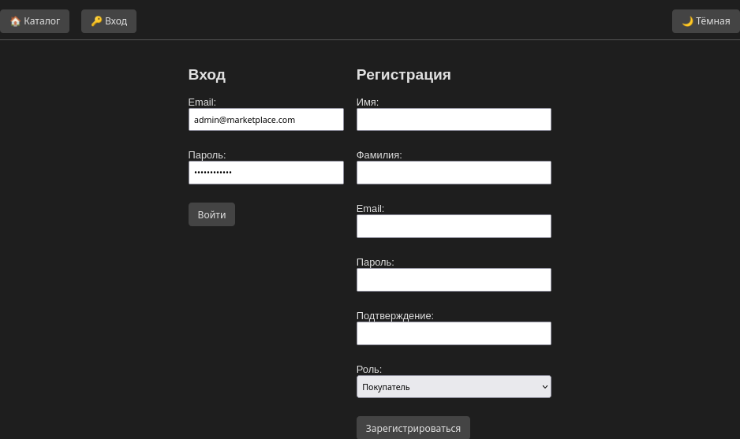
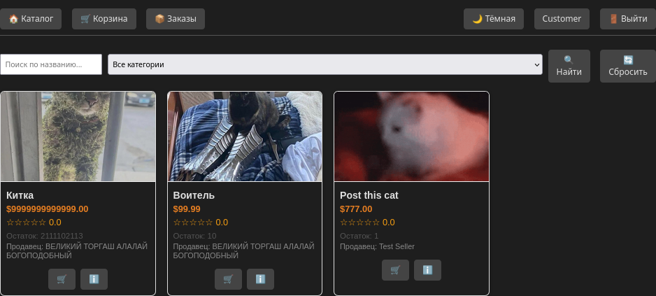
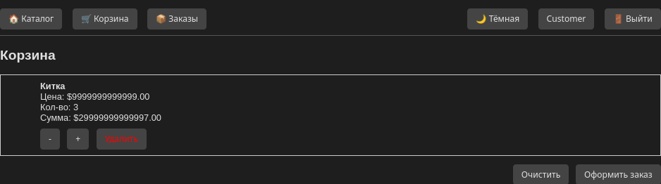
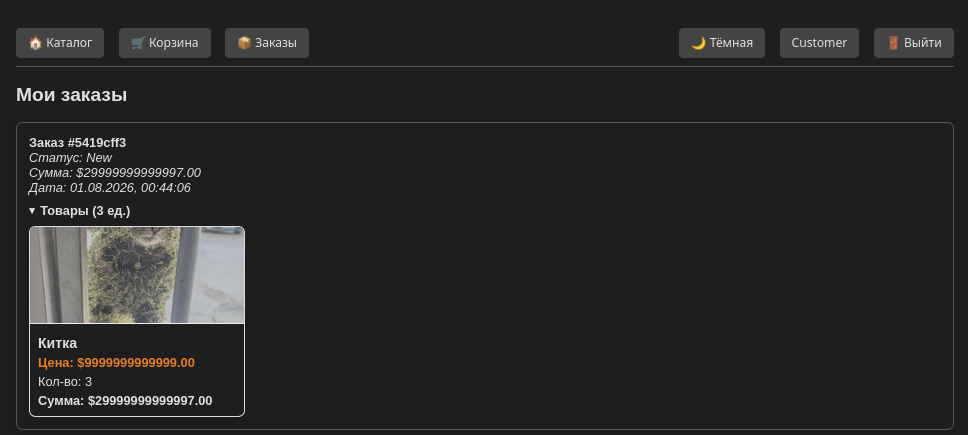
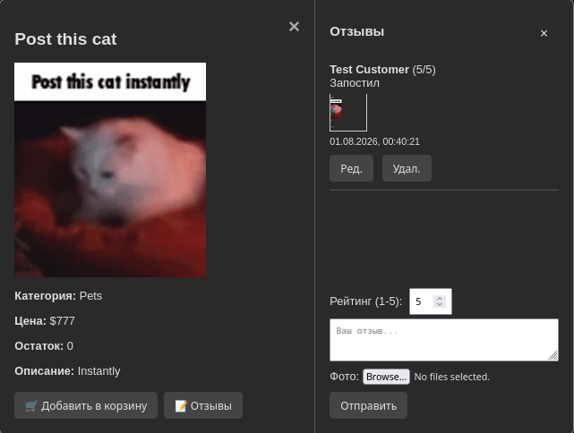
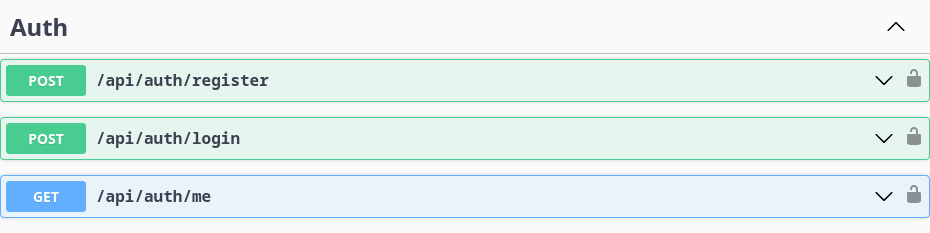
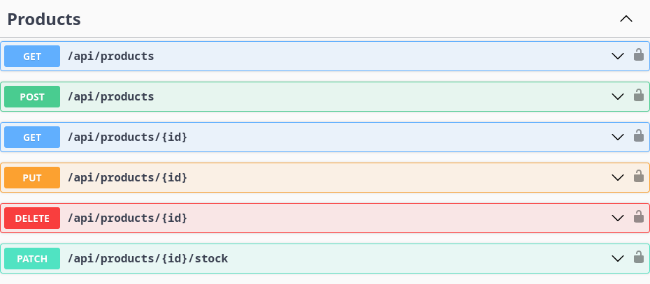
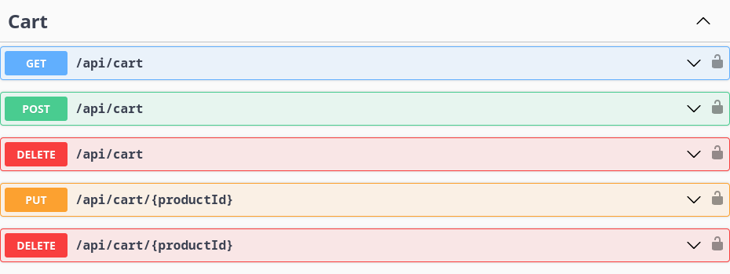
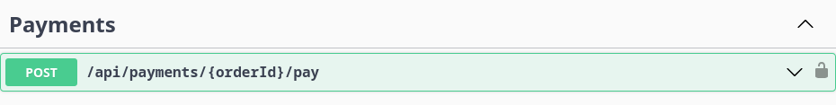
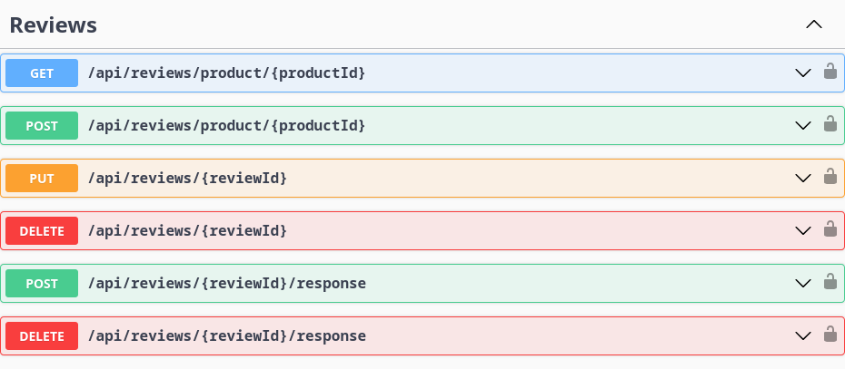

# Техническое задание (Курсовая работа на C#)
## Тема: Маркетплейс (референс — Ozon / Wildberries / Amazon)

### 1. Цель проекта
Разработать REST-API маркетплейса (мини-аналог Ozon/Wildberries/Amazon) для учебной курсовой работы. 
API должно поддерживать каталог товаров, функции продавца и покупателя, корзину и оформление заказа, управление остатками, отзывы, базовый поиск и имитацию платежного шлюза. 
Документация API — Swagger/OpenAPI.

### 2. Технологический стек
- C#, .NET 8 (LTS)
- PostgreSQL + EF Core (code-first)
- RabbitMQ (брокер сообщений)
- Serilog (логирование)
- Polly (resilience)
- Swagger / Swashbuckle
- XUnit (тесты)
- Docker / Docker Compose
- GitHub Actions (CI/CD)

### 3. Функциональные требования
#### Пользователи и роли
- Роли: Guest, Customer, Seller, Admin
- JWT-аутентификация
- Регистрация/вход, профиль пользователя

#### Каталог товаров
- CRUD для товаров и категорий
- Атрибуты (jsonb), изображения, вариации
- Поиск/фильтрация (ILIKE, jsonb)

#### Корзина и заказы
- Корзина (персистентная для Customer)
- Оформление заказа
- Жизненный цикл заказа: New → Paid → InProgress → Shipped → Delivered → Cancelled

#### Асинхронные события (RabbitMQ)
- Публикация событий при создании/обновлении/удалении товара (`product.created`, `product.updated`, `product.deleted`)
- События регистрации и входа пользователя (`user.registered`, `user.loggedin`)
- События создания отзыва и ответа на него (`review.created`, `review.response.added`)
- События жизненного цикла заказа (`order.created`, `order.status.changed`)
- Фоновые потребители (BackgroundService) логируют полученные сообщения
- Взаимодействие через интерфейс `IMessageBus` и реализацию `RabbitMqMessageBus`

#### Оплата
- Интерфейс `IExternalPaymentGateway`
- Реализация — mock/stub
- Polly (retry, circuit breaker)

#### Отзывы и оценки
- CRUD отзывов
- Модерация админом

#### Склад
- Управление остатками
- BackgroundService (low stock notification)

### 4. Архитектура (Clean)
1. **Domain/Core** — сущности, value objects, интерфейсы репозиториев  
2. **Application** — use cases, DTO, сервисы бизнес-логики  
3. **Infrastructure** — EF Core, внешние сервисы, хранилище файлов  
4. **Web/API** — контроллеры, middleware, Swagger  

### 5. Сущности БД
- users (id, email, password_hash, role, ...)
- categories (id, name, parent_id, ...)
- products (id, sku, title, price, stock, attributes jsonb, ...)
- product_images
- orders, order_items
- cart_items
- reviews
- audit_logs (опционально)

### 6. API (примеры эндпоинтов)
#### Пользователи

#### Товары

#### Корзина/Заказы

#### Оплата

#### Отзывы

### 7. Нефункциональные требования
- Async/await
- RBAC на эндпоинтах
- Swagger-документация
- Логирование Serilog (correlationId, userId, requestPath)
- Тесты: Unit (xUnit), Integration (TestServer/Postgres docker)
- Dockerfile + docker-compose.yml
- Асинхронная обработка событий через RabbitMQ

### 8. CI/CD
- GitHub Actions: build → test → docker build → миграции
- docker-compose для локального запуска
